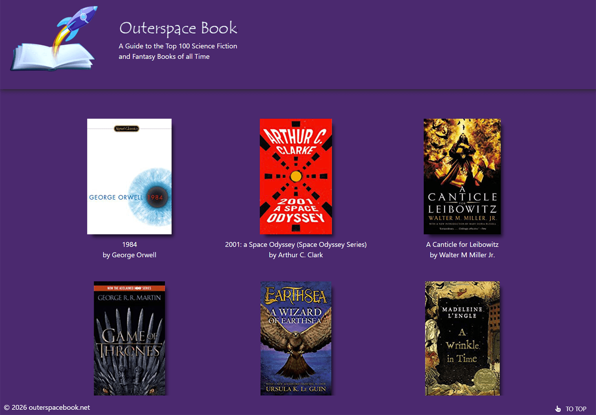

OuterSpaceBook.net website

This is a small, fun Vue.js application that displays the 100 best Science Fiction and Fantasy Books. It is live at www.outerspacebook.net. The technologies used are Vue.js version 3, Vue Composition API, Pinia, Axios, Vite. Click on a book image to see the details for a particular book. 

